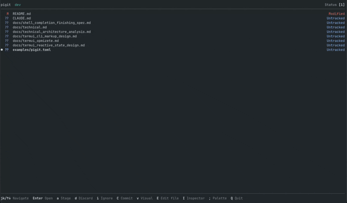
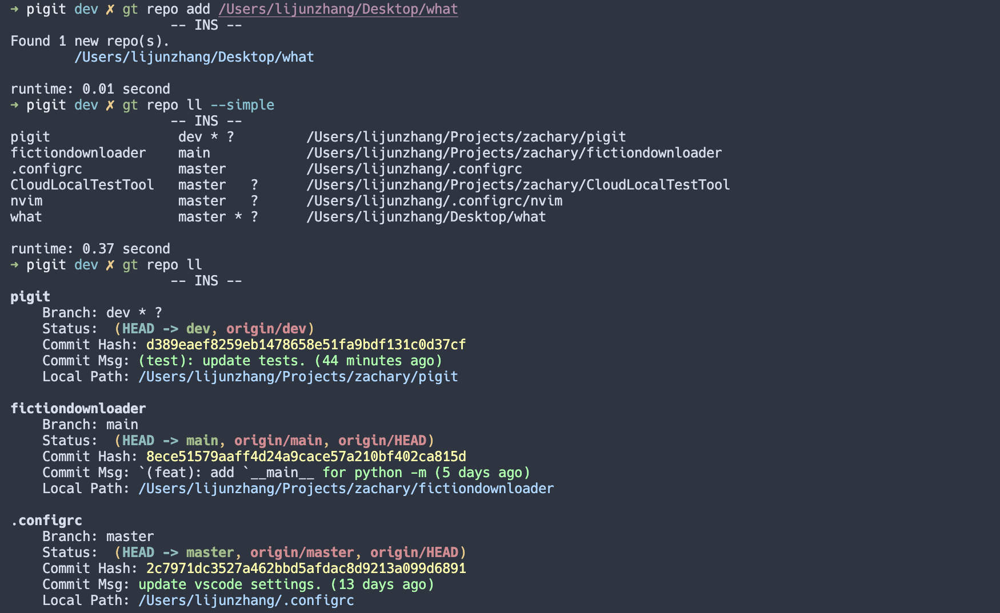
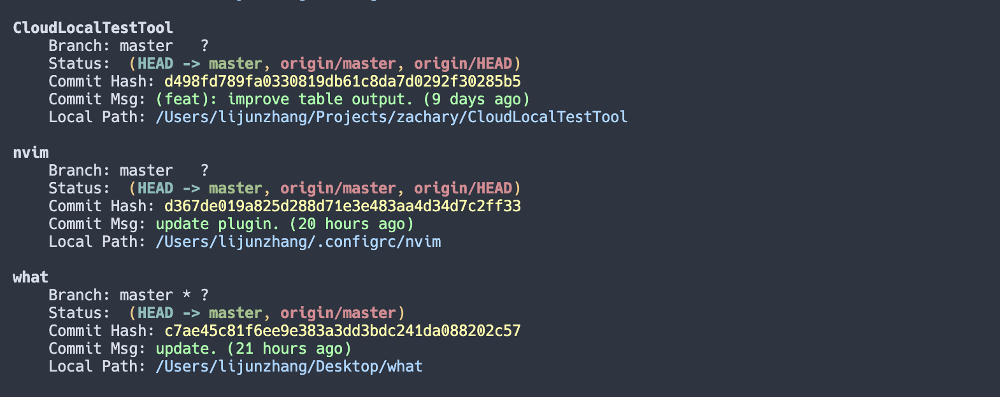
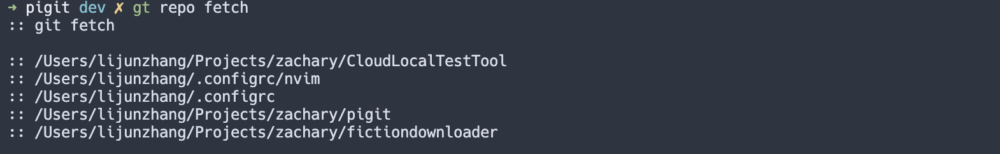

# PIGIT


[](https://pypi.org/project/pigit)
[](https://github.com/psf/black)

A terminal UI for Git, plus short command aliases and multi-repo management. Run `pigit` with no arguments to launch the TUI, or use sub-commands for quick one-off tasks.



## Quick Start

```bash
pip install -U pigit
pigit          # Launch TUI
```

## Installation

### Pip

```bash
pip install -U pigit
```

### Source

```bash
git clone https://github.com/zlj-zz/pigit.git --depth=1
cd pigit
make install
# or on Windows
python setup.py install
```

### Development (editable install)

```bash
pip install -e ".[dev]"
```

## TUI Mode

Pigit's primary interface is a terminal UI. Simply run `pigit` with no arguments to enter it.

The TUI provides interactive panels for status, branch list, commit log, diff viewer, and more. Use `j`/`k` or arrow keys to navigate, `Enter` to select, and `q` or `Esc` to go back. Press `?` at any time to see available key bindings.

**Status panel** — stage/unstage files with `a`, discard with `d`, ignore with `i`, and view inline diffs with `Enter`. A stash list sits at the bottom (`z` to push, `Z` to pop). On wide terminals a file-preview splits the view.

**Diff viewer** — press `H` to toggle hunk mode and stage/unstage individual hunks inline.

**Commit editor** — press `c` in the status panel to open an inline subject/body editor with lint feedback; `Ctrl+Enter` submits.

**Session history** — press `u` to undo the last action, or `U` to open a sheet and reverse multiple steps.

**Branch panel** — checkout, create, rename, and delete branches; `R` scopes to a repo sub-directory.

For operations that are cumbersome on the command line—such as staging individual hunks, browsing commit history with inline graphs, or resolving merge conflicts—the TUI is the recommended workflow.

> [!NOTE]
> The TUI requires an interactive terminal (both stdin and stdout must be TTYs). It will not launch in CI pipelines, scripts, or when piped.

## CLI Usage

For scripting, CI, or quick tasks, Pigit exposes sub-commands and flags.

```bash
usage: pigit [-h] [-i] [-f] [-r] [-v] [-c [PATH]] [--create-ignore TYPE]
             [--init [SHELL]] [--create-config]
             {cmd,repo,open} ...

Pigit TUI is called automatically if no parameters are followed.
```

### `cmd`

Short aliases for common git operations.


**Discovery**

- `pigit cmd -l` — list all short commands with help text and underlying `git` lines.
- `pigit cmd -s <query>` / `--search <query>` — filter by keyword.
- `pigit cmd -t <category>` — filter by category (branch, commit, index, etc.).
- `pigit cmd -p` / `--pick` — interactive picker (TTY only): `j`/`k` to move, `Enter` to run, `/` to filter, `q` to quit.

Example output from `pigit cmd -l`:

```
These are short commands that can replace git operations:
    b        lists, creates, renames, and deletes branches.
             git branch
    bc       creates a new branch.
             git checkout -b
    bl       lists branches and their commits.
             git branch -vv
    bd       delete a local branch by name.
             git branch -d
......
```

### `repo`

Manage multiple repositories at once.





- `pigit repo add <path>` — add repo(s) to the managed list.
- `pigit repo rm <name>` — remove repo(s).
- `pigit repo ll` — display summary of all repos.
- `pigit repo cd <name>` — print the path of a managed repo.
- `pigit repo cd -p` — open the interactive picker to choose a repo.
- `pigit repo fetch|pull|push [<name>...]` — run git operations across repos in parallel.

### `open`

Open the current repository's remote URL in a web browser.

```bash
pigit open              # open current branch
pigit open <branch>     # open specific branch
pigit open -c           # open at current commit
pigit open -i <number>  # open a specific issue
pigit open -p           # print URL instead of opening
```

### Other flags

| flag | description |
|------|-------------|
| `-i`, `--information` | show repository info |
| `-f`, `--config` | display local git config |
| `-r`, `--report` | show pigit description |
| `-c [PATH]`, `--count [PATH]` | code statistics (table or simple format) |
| `--create-ignore TYPE` | generate a `.gitignore` template |
| `--create-config` | create a config file at `~/.config/pigit/pigit.toml` |

## Shell Integration

`pigit --init` generates shell completion scripts **and** a `pigit` wrapper function.

> [!TIP]
> Run `--init` once: it sets up both tab-completion and the `repo cd` auto-`cd` wrapper. You do not need a separate completion-only step.

Add it to your shell configuration:

```sh
# ~/.bashrc or ~/.zshrc
eval "$(pigit --init)"
```

Supports `bash`, `zsh`, and `fish`. If no shell is specified, it auto-detects from `$SHELL`.

### Auto `cd` with `repo cd`

After sourcing the init script, `pigit repo cd -p` automatically changes your shell's working directory when you pick a repo. The wrapper intercepts `pigit repo cd`, runs the picker, and `cd`s into the selected path.

For scripts and CI, use `--output-file <path>` to write the selected directory to a file instead.

## Alias

Add to your shell profile for faster access:

```bash
if type pigit >/dev/null 2>&1; then
    alias pg="pigit"
    alias gr="pigit repo"
fi
```

**Windows (PowerShell)**

```ps
set-alias pg pigit
```

## Configuration

Create a template config with `pigit --create-config`. The config lives at:

- Linux/macOS: `~/.config/pigit/pigit.toml`
- Windows: `%USERPROFILE%\pigit\pigit.toml`

See [`examples/pigit.toml`](./examples/pigit.toml) for a full template.

| section | key | type | default | description |
|---------|-----|------|---------|-------------|
| `[cmd]` | `display` | bool | `True` | show original git command |
| `[cmd]` | `recommend` | bool | `True` | suggest corrections for wrong commands |
| `[counter]` | `use_gitignore` | bool | `True` | respect `.gitignore` when counting |
| `[counter]` | `show_invalid` | bool | `False` | show files that cannot be counted |
| `[counter]` | `show_icon` | bool | `True` | show file icons (requires Nerd Font) |
| `[counter]` | `format` | str | `table` | output format: `table` or `simple` |
| `[info]` | `git_config_format` | str | `table` | git config display: `table` or `normal` |
| `[info]` | `repo_include` | list | `["remote", "branch", "log"]` | sections to show in repo info |
| `[repo]` | `auto_append` | bool | `True` | auto-add current repo to managed list |
| `[log]` | `debug` | bool | `False` | debug mode |
| `[log]` | `output` | bool | `False` | print logs to terminal |

## Custom Commands

Define aliases and scripts in `pigit.cmds.toml` inside the pigit home directory.

### Aliases

```toml
[cmd_new.aliases]
mybl = "bl"
mylog = "log --oneline --graph"
```

### Scripts

```toml
[cmd_new.scripts.myscript]
steps = ["status", "log --oneline"]
help = "Show status then log"
category = "script"

# concise form for simple step lists
[cmd_new.scripts]
quick-check = ["status", "diff --cached"]
```

User-defined entries appear in `pigit cmd -l`, search, and `--pick` with `[alias]` or `[script]` prefixes.

## Features

- **TUI-first workflow** — interactive panels for status, branch, commit log, diff, and more.
- **Session history / undo** — one-key reversal (`u`) and a browsable undo stack (`U`).
- **Inline commit editor** — subject/body fields with lint bar inside the TUI.
- **Hunk staging** — stage or unstage individual hunks directly in the diff viewer (`H`).
- **Stash management** — push, pop, and drop stashes from the status panel.
- **Adaptive layout** — side-by-side preview panel on large terminals.
- **Short commands** — aliases like `pigit cmd st` for `git status --short`.
- **Command correction** — suggests the right command when you typo.
- **Multi-repo management** — `repo` sub-commands for bulk operations across projects.
- **Shell completion** — bash/zsh/fish with `pigit --init`.
- **Auto `cd`** — shell wrapper enables `pigit repo cd -p` to change directory after picking.
- **Code statistics** — count lines/files by type with table or simple output.
- **`.gitignore` templates** — generate from common types.
- **Quick open remote** — open repo/commit/issue in browser.
- **Custom aliases & scripts** — extend via TOML config.

---

LICENSE: [MIT](./LICENSE)
