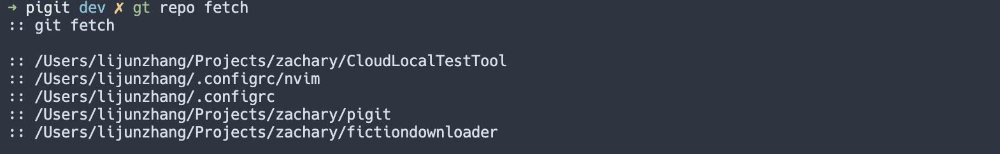

# PIGIT


[](https://pypi.org/project/pigit)
[](https://github.com/psf/black)

A terminal tool for git. Read as [Pi Git], meaning to use git like pig it. When we use git, do you feel very uncomfortable with too long commands. For example: `git status --short`, this project can help you improve it. This project is written in Python. Now most UNIX like systems come with Python. So you can easily install and use it.

## Usage

If you want to use it, you must first know what it can do.

The command of `pigit -h` or `pigit --help` to get the help message with usage. Like this:

```bash
usage: pigit [-h] [-v] [-r] [-f] [-i] [-c [PATH]] [-C] [--create-ignore TYPE]
             [--create-config]
             {cmd,repo} ...

Pigit TUI is called automatically if no parameters are followed.

positional arguments:
  {cmd,repo}
    cmd                 git short command.
    repo                repo options.
    open                open remote repository in web browser.

optional arguments:
  -h, --help            show this help message and exit
  -v, --version         Show version and exit.
  -r, --report          Report the pigit desc and exit.
  -f, --config          Display the config of current git repository and exit.
  -i, --information     Show some information about the current git repository.

tools arguments:
  Auxiliary type commands.

  -c [PATH], --count [PATH]
                        Count the number of codes and output them in tabular form.A given path can be
                        accepted, and the default is the current directory.
  -C, --complete        Add shell prompt script and exit.(Supported bash, zsh, fish)
  --create-ignore TYPE  Create a demo .gitignore file. Need one argument, support: [android, c++, cpp, c,
                        dart, elisp, gitbook, go, java, kotlin, lua, maven, node, python, qt, r, ros, ruby,
                        rust, sass, swift, unity]
  --create-config       Create a pre-configured file of PIGIT.(If a profile exists, the values available in it
                        are used)
```

### `cmd`

The command of `cmd` support some short sub-command to replace the long git original command.


Use `pigit cmd -s` to check what short command it supported, it will display the corresponding help information and the git original command, like this:

```
These are short commands that can replace git operations:
    b        lists, creates, renames, and deletes branches.
             git branch
    bc       creates a new branch.
             git checkout -b
    bl       lists branches and their commits.
             git branch -vv
    bL       lists local and remote branches and their commits.
             git branch --all -vv
    bs       lists branches and their commits with ancestry graphs.
             git show-branch
    bS       lists local and remote branches and their commits with ancestry graphs.
             git show-branch --all
    bm       renames a branch.
             git branch --move
    bM       renames a branch even if the new branch name already exists.
             git branch --move --force
    bd       delete a local branch by name.
             git branch -d
......
```

### `repo`

The command of `repo` support operate multiple repos at the same time.




Use `pigit repo -h` to get more help.

### Interaction

Even if you can use short commands instead of long commands of git, there are still some cases where simple commands can be very bad. For example: `git add a/b/1.txt b/c/1.txt c/d/1.txt`.

Therefore, we need a TUI to help us, so Pigit provides a simple command-line interactive TUI. When you use `pigit` without following any parameters, you will enter it.


And in the interaction mode, you can use `?` or `h` to see the help message.

## Installation

### Pip

```bash
pip install -U pigit
```

### Source

```bash
git clone https://github.com/zlj-zz/pigit.git --depth=1
cd pigit
make install
# or
python setup.py install  # On windows
```

## Alias

Alias is good way to help you use _pigit_ faster . Open your shell profile and append:

```bash
if type pigit >/dev/null 2>&1; then
    alias pg="pigit"
    alias g="pigit cmd"
    alias gr="pigit repo"
fi
```

Then, you can use `pg` to call `pigit` and use `g` to call `pigit cmd`.

## Configuration

You can use `pigit --create-config` to create a template configuration at **pigit** home path.

On Linux or MacOS: `~/.config/pigit`

On windows should be: `C:\\User\\<your username>`

[here](./docs/pigit.conf) is a configuration template.

| config key                  | type  | default                     | desc                                                                                                                        |
| --------------------------- | ----- | --------------------------- | --------------------------------------------------------------------------------------------------------------------------- |
| cmd_show_original           | bool  | True                        | Show original git command.                                                                                                  |
| cmd_recommend               | bool  | True                        | Is it recommended to correct when entering wrong commands.                                                                  |
| tui_help_showtime           | float | 1.5                         | Display time of help information in interactive mode.                                                                       |
| counter_use_gitignore       | bool  | True                        | Whether to use the ignore configuration of the `.gitignore` file.                                                           |
| counter_show_invalid        | bool  | False                       | Whether show files that cannot be counted.                                                                                  |
| counter_show_icon           | bool  | True                        | Whether show files icons. Font support required, like: 'Nerd Font'.                                                         |
| counter_format              | str   | table                       | Output format of statistical results. Supported: [table, simple]                                                            |
| git_config_format           | str   | table                       | Git local config print format. Supported: [table, normal]                                                                   |
| repo_info_include           | list  | ["remote", "branch", "log"] | Control which parts need to be displayed when viewing git repository information. Support: (path,remote,branch,log,summary) |
| repo_auto_append            | bool  | False                       | Whether auto append path to repos.                                                                                          |
| debug_open                  | bool  | False                       | Whether run PIGIT in debug mode.                                                                                            |
| log_output                  | bool  | False                       | Whether output log in terminal.                                                                                             |

## Extra cmds

You can setting your custom cmds. It need create a `extra_cmds.py` file at the **pigit** home. And writing like this:

```python
import os

def print_user(args):
    print(os.system('whoami'))

extra_cmds = {
    'echo': {
        'command': 'echo 123',
    },
    'print-user': {
        'command': print_user,
        'type': 'func',
        'help': 'print system user name.'
    }
}
```

The `extra_cmds` dict is must. And the structure is command key and command info.

The command info has some options:

- `command`: (Must have) Short life corresponds to the complete command or a method. If it is a method, it must receive a parameter tuple.
- `type`: (Option) Mark the type of command, support ['func', 'command'], and the default is 'command'.
- `help`: (Option) Command help message.
- `has_arguments`: (Option, bool) Whether the command accepts parameters. Default is True.

## Feature

- Short command for quick use Git, and custom your short command.
- Provides command correction, when the command is wrong.
- Have a simple tui interaction, complete very troublesome operations.
- Code statistics and can be beautifully displayed.
- Support generate and use shell completion script.
- Support create `.gitignore` template from internet.
- Support quick open remote url on website.
- Support manage multi repos.
- Have log output and help message tips.

---

LICENSE: [MIT](./LICENSE)
