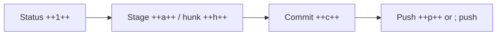
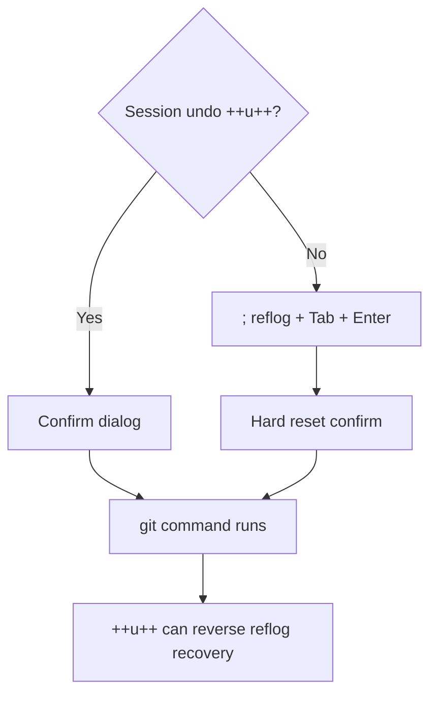

# Workflows

Task-oriented paths through the TUI and CLI.

## Daily edit → commit → push



1. `pigit` — review changed files in **Status** (++1++).
2. Stage with ++a++ or stage hunks in the **Diff** viewer (++h++, then ++s++).
3. Commit with ++c++ (inline editor + lint bar).
4. ++p++ to push or ++semicolon++ → `push`.

## Recover from a mistake



### Inside the session (++u++)

Press **++u++** to reverse the last recorded action. A confirmation dialog shows
the git command that will run. Undo refuses when the worktree has uncommitted
changes.

Press **++shift+u++** to pick from the undo stack.

### Outside the session (`; reflog`)

When ++u++ reports nothing to reverse:

1. Press **++semicolon++**
2. Type `reflog ` and filter by message or SHA
3. **Tab** to fill, **Enter** to confirm recovery
4. Confirm the hard reset dialog (dirty worktree is rejected)

The recovery itself is undoable with **++u++**.

## Merge and rebase

While a merge, rebase, or cherry-pick is active, the command palette lists
sequencer commands (`continue-merge`, `rebase-continue`, etc.). Use **++u++**
after a completed merge/rebase/cherry-pick to rewind HEAD when needed.

For interactive rebase setup, use Branch ++r++ (todo editor) or git directly;
pigit surfaces continue/abort/skip controls once the sequencer is running.

## Multi-repo sweep

```bash
pigit repo add ~/dev/foo ~/dev/bar
pigit repo ll
pigit repo fetch
pigit repo pull
```

Use `pigit repo cd -p` (with shell init) to jump between repos in your shell,
or the in-TUI repo switcher (`@` / header click) to change context without
exiting.

## Inspect before acting

Press **++i++** on a file, stash, branch, or commit to open the inspector sheet.
Scroll with ++j++ / ++k++, close with ++esc++ or ++i++.

## Create a pull request

1. **Branch** panel → select your feature branch
2. Press **++p++** to open the hosting provider's create-PR URL
3. Or use `pigit open` from the shell — see [CLI](cli.md)
