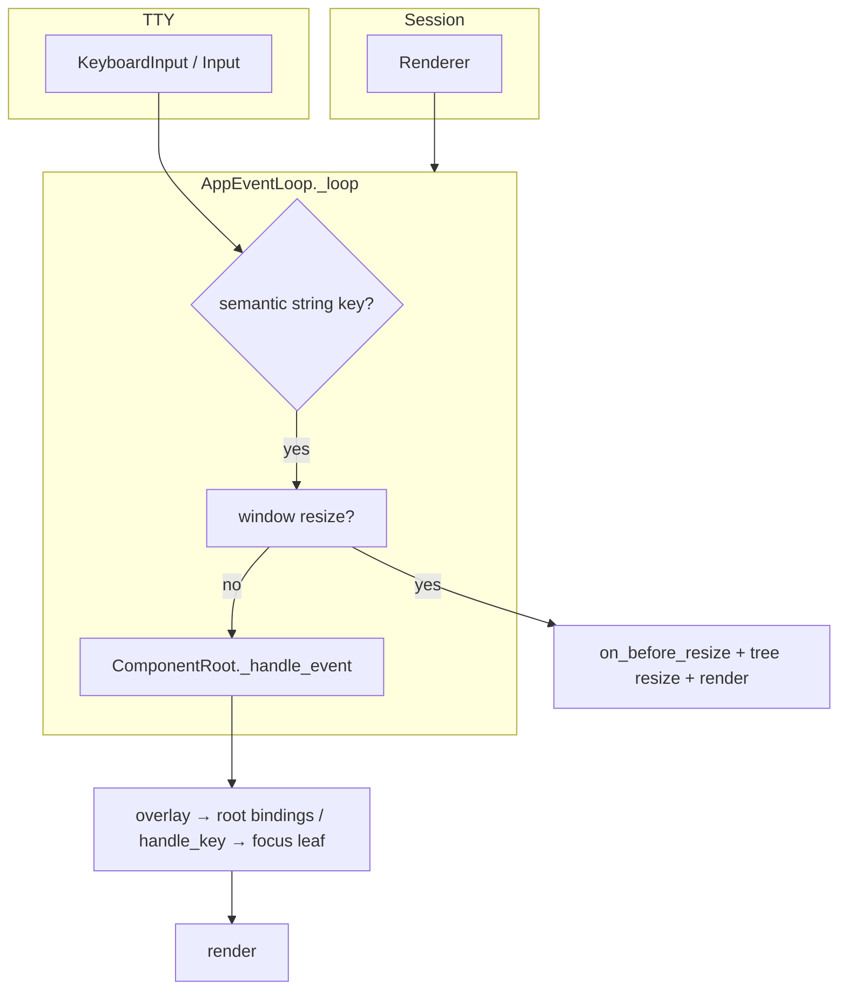
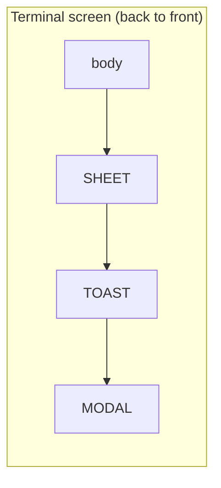
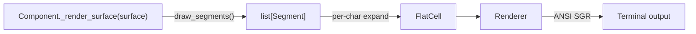

# Developing `pigit.termui`

Maintainer and contributor guide. For app authors, start with
[`README.md`](README.md).

## Architecture

The package separates **input semantics**, **rendering**, **component trees**,
**bindings**, and **overlay modality**. Application code (for example
`pigit.app`) composes apps via `Application` without owning TTY details.

### Key dispatch flow



- **Session** opens the alternate screen and creates a **Renderer**.
- **Renderer** is bound via ContextVar (`set_renderer` / `reset_renderer`).
- Loop root is `ComponentRoot` (overlay dispatch, app bindings, focus leaf).
- Body keys: `FocusManager.get_focus_leaf()` → `capture_key` → bindings →
  `handle_key` → parent bubble.
- **`Application`** wraps `build_root()` → `ComponentRoot` → `AppEventLoop`.

### Focus and presentation

| Hook | Walk | Meaning |
|------|------|---------|
| `focus_child` | `resolve_focus_leaf` | Who receives the next key |
| `presentation_child` | `resolve_presentation_leaf` | Who owns help / footer / panel chrome |

### Layer stacking



TOAST and SHEET do not intercept keys; MODAL does.

### Segment render pipeline



## Package map

### Public source modules (honest names)

| Module | Role |
|--------|------|
| `application.py` | `Application` façade |
| `root.py` | `ComponentRoot` |
| `component.py` | `Component` ABC, `bind_signals`, `render_child`, … |
| `bindings.py` | `bind_action`, `Binding`, … |
| `overlay.py` | `show_toast` / `show_sheet` / badge / spinner / `exec_external` |
| `surface.py` / `segment.py` | Drawing contract |
| `mouse.py` / `async_task.py` / `feedback.py` | Input, async, feedback kinds |
| `theme.py` / `palette.py` / `keys.py` / `types.py` | Theme, colors, keys, enums |
| `syntax.py` / `renderer.py` | Advanced; **not** re-exported on root |
| `event_loop.py` | `AppEventLoop`, `ExitEventLoop` (only `ExitEventLoop` on root) |
| `event_bus.py` / `reactive.py` | Pub/sub and signals (subpackage imports) |
| `widgets/` | All widget classes (sole public entry: `widgets.__init__`) |
| `containers/` | `Row`, `Column`, `TabView`, `SplitPane` |
| `primitives/` | Text / frame / ANSI / word-diff / gutter / calendar helpers |

### Private / engine (`_` — do not export on root)

| Module | Role |
|--------|------|
| `_runtime_context.py` | ContextVar hub; root only re-exports getters |
| `_layer.py` | `LayerStack`, `Layer` |
| `_session.py` | TTY session |
| `_color.py` | Color quantization |
| `_layout.py` | Flex layout engine |
| `_markup.py`, `_component_event.py` | Internals |
| `_syntax_configs.py` | Syntax keyword tables |

Platform helpers (`tty_io`, `wcwidth_table`, `cli_output`, `input`) stay as
named modules; they are not part of the root façade.

## Export contract (tiered API)

`__init__.py` defines the **stable public contract**, not a dump of every symbol.

| Tier | Where | Rule |
|------|-------|------|
| **0** | `pigit.termui` | High-frequency, semver-stable, documented in README |
| **1** | `widgets` / `containers` / `primitives` / `reactive` / … | Stable domain imports; users write the full path |
| **2** | `_layer`, `_session`, `_runtime_context` setters, … | Unstable; framework + tests only |

Locked decisions (see `docs/superpowers/specs/2026-08-20-termui-public-api-export-design.md`):

- Widget classes **never** on root.
- Text/diff/layout helpers live in **`primitives`** (not root).
- Hard cut: no deprecated root re-exports when moving symbols.
- `palette` remains on root for now.
- Do **not** export `_Subsurface`.

When changing root exports:

1. Update `pigit/termui/__init__.py` (`__all__` must match imports).
2. Update `REQUIRED_ROOT` in `tests/termui/test_public_api_exports.py` (exact equality).
3. Update [`README.md`](README.md) if the user-facing surface changed.

### Adding a new API

| Kind of API | Put it |
|-------------|--------|
| New root concept (`Component`-level) | Tier 0 |
| New widget | `widgets` only |
| New layout container | `containers` only |
| Pure text/layout/diff helper | `primitives` |
| Engine / TTY / color internals | `_` module; document as unstable |
| Experimental | consider `termui.experimental` later |

## Import rules

### Outside the package (apps and tests)

```python
# Preferred
from pigit.termui import Application, Component, show_toast
from pigit.termui.widgets import ItemList, Sheet
from pigit.termui.primitives import plain

# Avoid in pigit/app*.py (ratcheted)
from pigit.termui._layer import LayerStack          # private
from pigit.termui.widgets.sheet import Sheet        # deep leaf path
```

### Inside `pigit.termui`

Use **relative** imports to source modules. Never depend on the root façade:

```python
# Correct
from .component import Component
from . import keys
from .reactive import Signal

# Wrong — cycles and façade coupling
from pigit.termui import Component
```

## App-layer ratchets

| Test | Rule |
|------|------|
| `tests/termui/test_app_private_imports.py` | `app*.py` must not import `pigit.termui._*` (`ALLOWED` empty) |
| `tests/termui/test_app_deep_widget_imports.py` | `app*.py` must not import `pigit.termui.widgets.<leaf>` |
| `tests/termui/test_public_api_exports.py` | Root `__all__` == `REQUIRED_ROOT`; forbidden symbols stay off root |
| `tests/termui/test_primitives_api.py` | `primitives` façade exports |

Framework unit tests may import `_layer` / `_runtime_context` for white-box
coverage; application modules must not.

## Design constraints

1. **No mixins** — prefer composition, helpers, or small base classes.
2. **Segment-first rendering** — new text uses `Segment` / `draw_segments`; do not add `(text, fg, bold)` call sites. (`DiffViewer` in app remains an explicit exception.)
3. **Colors / styles via `palette` or `Theme`** — avoid hard-coded RGB in new framework widgets when a theme role exists.
4. **Keys via `keys`** — no raw escapes for special keys.
5. **Render interface** — implement `_render_surface(surface)`; do not add new `_render()` paths.
6. **Overlay cleanup** — handlers that show spinners/sheets must clean up on all exception paths.
7. **File headers** — new modules use the project header + Google-style docstrings; English inline comments.

## Overlay notes (for maintainers)

1. `LayerStack` owns `NONE` / `MODAL` / `TOAST` / `SHEET`.
2. App code prefers `show_toast` / `show_sheet` / `Popup` rather than pushing layers directly.
3. `HelpPanel` is content; wrap with `Popup` for modal chrome.
4. After overlay key handling, `sync_focus_to_overlay_or_leaf()` re-resolves focus (important for Sheet editors).

## Tests

```bash
python3 -m pytest tests/termui -q
python3 -m pytest ./tests -q
```

Contract tests to run when touching exports or app imports:

```bash
python3 -m pytest \
  tests/termui/test_public_api_exports.py \
  tests/termui/test_primitives_api.py \
  tests/termui/test_app_private_imports.py \
  tests/termui/test_app_deep_widget_imports.py -q
```
