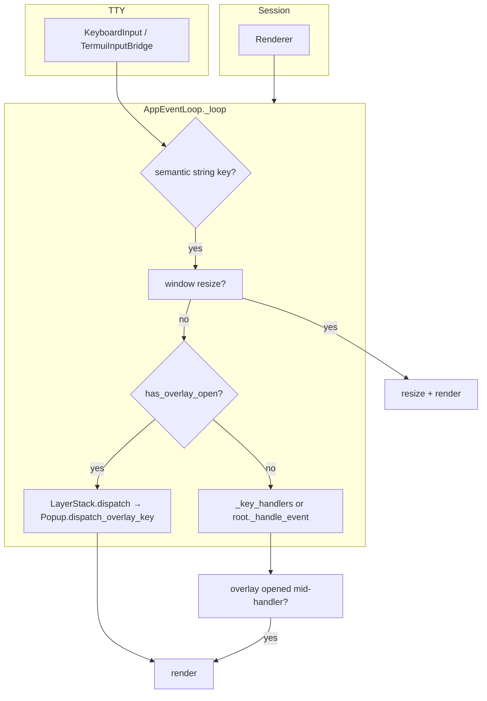

# `pigit.termui`

Lightweight, keyboard-first terminal UI primitives for full-screen TUIs and modal overlays. The package separates **input semantics**, **rendering**, **component trees**, **bindings**, and **overlay modality** so application code (for example `pigit.app`) can compose apps via `Application` without duplicating low-level terminal logic.

## Goals

- **Single event loop** over a **component tree** with optional **decorator/class `BINDINGS`** merging.
- **Layered overlays (MODAL / TOAST / SHEET) via LayerStack**: keys are routed to the top-most MODAL layer when open; unbound keys do not fall through to the main content (modal-style behavior). TOAST and SHEET layers do not intercept input.
- **POSIX TTY** session handling (alternate screen, termios) isolated from keyboard decoding.
- **Renderer context via ContextVar**: components access the current renderer through `get_renderer()` / `get_renderer_strict()` without tree traversal.
- **Safe overlay text** via `sanitize_for_display` (control characters stripped or normalized).

## Architecture (overview)



- **Session** opens the alternate screen and creates a **Renderer**.
- **Renderer** is bound to the current context via `ContextVar` (`set_renderer` / `reset_renderer`).
- **Loop root** (`_child`) is `ComponentRoot`, which delegates overlay checks and dispatch to `LayerStack`.
- **Application** facade (`Application` class) wraps `build_root()` → `ComponentRoot` → `_ApplicationEventLoop` assembly.

## Package map

| Module | Role |
|--------|------|
| `_component_base.py` | `Component` ABC, `ComponentError`, `nearest_overlay_host()` |
| `_component_mixins.py` | `GitPanelLazyResizeMixin` (defer `fresh`), `OverlayClientMixin` (toast/sheet helpers) |
| `_component_layouts.py` | `TabView` (tabbed stack), `Column`, `Row` (layout containers) |
| `_component_widgets.py` | `ItemSelector` (cursor list), `LineTextBrowser` (scrollable text) |
| `_overlay_components.py` | `Popup` (modal shell), `AlertDialog`, `HelpPanel`, `Toast`, `Sheet` |
| `_layer.py` | `LayerStack`, `Layer`, `LayerKind` (`NONE` / `MODAL` / `TOAST` / `SHEET`) |
| `_root.py` | `ComponentRoot`: internal framework root, wraps body + LayerStack |
| `_application.py` | `Application` facade: high-level entry point for app wiring |
| `event_loop.py` | `AppEventLoop`, `ExitEventLoop`; resize → overlay → main dispatch |
| `picker_event_loop.py` | `PickerAppEventLoop`: full-screen picker with `(exit_code, message)` returns |
| `_session.py` | `Session`: TTY setup, creates `Renderer` |
| `_renderer.py` | `Renderer`: cursor moves, `draw_panel`, incremental `render_surface` |
| `_renderer_context.py` | `get_renderer()`, `get_renderer_strict()`, `set_renderer()` via `ContextVar` |
| `_surface.py` | `Surface` / `Cell` intermediate layer; `subsurface` for component clipping |
| `_bindings.py` | `bind_keys`, `list_bindings`, `BindingError`, merged handler resolution |
| `keys.py` | Semantic key constants and helpers (e.g. `KEY_ESC`, `is_mouse_event`) |
| `_text.py` | Display width (`get_width`, `plain`), `sanitize_for_display` |
| `input_keyboard.py` | Low-level byte reader → semantic strings |
| `input_terminal.py` | `InputTerminal` protocol |
| `input_bridge.py` | Bridge implementing `InputTerminal` over `KeyboardInput` |
| `_geometry.py` | `TerminalSize` and related helpers |
| `_picker.py` | `SearchableListPicker` component (CLI/repo flows) |
| `picker_layout.py` | Layout helpers for pickers |
| `tty_io.py`, `wcwidth_table.py`, `input_trie.py` | Internal utilities for I/O and width |
| `types.py` | `ActionLiteral`, `LayerKind`, `OverlayDispatchResult`, `ToastPosition`, protocols |

## Minimal example

Run from a real terminal (TTY). This shows a one-line screen and quits on `q`:

```python
from pigit.termui import AppEventLoop, Component, ExitEventLoop


class DemoRoot(Component):
    NAME = "demo"

    def _render_surface(self, surface):
        surface.draw_row(0, "termui minimal demo — press q to quit")


class DemoLoop(AppEventLoop):
    BINDINGS = [("q", "quit")]

    def quit(self) -> None:
        raise ExitEventLoop("bye")


if __name__ == "__main__":
    DemoLoop(DemoRoot(), alt=False).run()
```

Full Git TUI wiring (tabs, help, alerts, toasts) lives in `pigit.app` (`PigitApplication(Application)`).

## Public API (`from pigit.termui import …`)

Stable names are listed in `__all__` inside `__init__.py`. Highlights:

- **Tree**: `Component`, `TabView`, `Column`, `Row`, `ActionLiteral`, `LazyLoadMixin`, `ItemSelector`, `LineTextBrowser`
- **Overlay**: `Popup`, `AlertDialog`, `AlertDialogBody`, `HelpPanel`, `HelpEntry`, `Sheet`, `Toast`, `LayerKind`, `OverlayDispatchResult`, `ToastPosition`
- **Application**: `Application`, `ComponentRoot` (internal but exported), `ExitEventLoop`
- **Loop**: `AppEventLoop`, `Session`, `Renderer`, `TerminalSize`
- **Bindings**: `bind_keys`, `list_bindings`, `BindingError`
- **Picker**: `SearchableListPicker`, `PickerRow`
- **Text**: `sanitize_for_display`, `get_width`, `plain`

Import the package once for app-level wiring:

```python
from pigit.termui import Application, Component, TabView, bind_keys, keys
```

## Architecture (detail)

### Application facade

`Application` is the high-level entry point. Subclasses implement `build_root()` and optional `BINDINGS`:

```python
class MyApp(Application):
    BINDINGS = [("Q", "quit")]

    def build_root(self):
        return TabView({"main": MyPanel()})

    def setup_root(self, root):
        # Attach overlays here
        self._help_popup = Popup(self._help_panel, session_owner=root)

    def quit(self):
        raise ExitEventLoop("Quit")

MyApp().run()
```

`_ApplicationEventLoop` bridges `Application` into `AppEventLoop`: app-level bindings take precedence over child tree bindings when no overlay is open.

### Component tree and loop root

`AppEventLoop` holds a single **root** `Component` (`_child`). In practice this is `ComponentRoot`, which owns a `LayerStack` and a body component. `ComponentRoot` implements `has_overlay_open()` and `try_dispatch_overlay(key)` by delegating to its `LayerStack`.

Application code constructs **`Popup(help_panel, session_owner=self, …)`** (``_help_panel`` / ``_help_popup``); the shell resolves the host like **`AlertDialog`** (``session_owner`` may be the root host or a child; :meth:`~pigit.termui._overlay_components.Popup._resolved_overlay_host` uses :meth:`~pigit.termui._component_base.Component.nearest_overlay_host` or treats ``session_owner`` as the host when it owns overlay state). Call :meth:`~pigit.termui._overlay_components.HelpPanel.merge_help_entries_from_host_children` from the app when opening help if you want rows synced from ``host.children`` (not from ``Popup``). Bind ``?`` to a handler that refreshes help then **`_help_popup.toggle()`**. **`AlertDialog`** subclasses **`Popup`**, passes **`session_owner``** to the base, overrides ESC via **`_on_exit_key`**, and uses session management via the resolved host.

Panels that open alert sessions typically expose **`_alert_dialog`** and **`_alert_popup`** (often the same `AlertDialog` instance).

### Overlay flow

1. **State**: `LayerStack` manages layers by `LayerKind`: `NONE`, `MODAL`, `TOAST`, `SHEET`. `ComponentRoot` is the overlay host; `Popup` / `AlertDialog` push/pop `MODAL` layers.
2. **Shell**: Any component can gain modal behavior when wrapped by :class:`~pigit.termui._overlay_components.Popup`; `ComponentRoot` delegates overlay management to `LayerStack`.
3. **Help**: :class:`~pigit.termui._overlay_components.HelpPanel` is content only; :class:`~pigit.termui._overlay_components.Popup` with ``session_owner`` runs :meth:`~pigit.termui._overlay_components.Popup.toggle` / ESC against the resolved host. The app may sync rows via :meth:`~pigit.termui._overlay_components.HelpPanel.refresh_entries_from_source` before toggling open.
4. **Alert**: A panel owns `_alert_dialog` / `_alert_popup` (same `AlertDialog` instance); opening pushes a `LayerKind.MODAL` layer onto `LayerStack`.
5. **Dispatch**: `LayerStack.dispatch` forwards keys to the top-most MODAL layer's `OverlaySurface` via ``dispatch_overlay_key`` (shell bindings, then child, then ``Popup._fallback_overlay_key`` for help ``?`` or swallow). TOAST and SHEET layers do not intercept input dispatch. Handler failures yield :data:`~pigit.termui.types.OverlayDispatchResult.CLOSED_AFTER_ERROR` and cleanup the modal slot.
6. **Toast**: `ComponentRoot.show_toast()` creates a `Toast` on the `TOAST` layer with slide-in/out animation and auto-expiration. Only one toast is shown at a time.
7. **Sheet**: `ComponentRoot.show_sheet()` creates a `Sheet` on the `SHEET` layer (bottom panel).

### Rendering and ContextVar

`Session` creates a `Renderer` bound to the terminal. `AppEventLoop.run()` enters the Session context and calls `set_renderer(session.renderer)`, making the renderer available to all components via:

```python
renderer = self.renderer        # get_renderer() — may be None
renderer = self.renderer_strict # get_renderer_strict() — raises if not set
```

`AppEventLoop.render()` builds a `Surface`, calls `_render_surface()` on the root component tree, and then `LayerStack.render(surface)` after body render so overlays are drawn on top.

Components implement `_render_surface(surface)` instead of the legacy `_render()`. `Surface` provides `draw_text`, `draw_row`, `draw_box`, `fill_rect`, and `subsurface` for child clipping.

### Bindings

`bind_keys` attaches handlers to methods; class-level `BINDINGS` lists are merged with `resolve_key_handlers_merged`. Duplicate keys toward the same target raise `BindingError` in strict mode (see `_bindings.py`).

```python
class MyPanel(Component):
    BINDINGS = [("q", "quit")]

    @bind_keys("j", keys.KEY_DOWN)
    def next(self):
        ...

    def quit(self):
        raise ExitEventLoop("Quit")
```

## Related application code

`pigit.app` defines `PigitApplication(Application)` and Git-specific panels; it imports from `pigit.termui` as the single entry point for the primitives above.

## Tests

Project tests under `tests/tui/` and `tests/termui/` cover bindings, the event loop, and input contracts. Run them with:

```bash
python3 -m pytest tests/tui tests/termui -q
```
