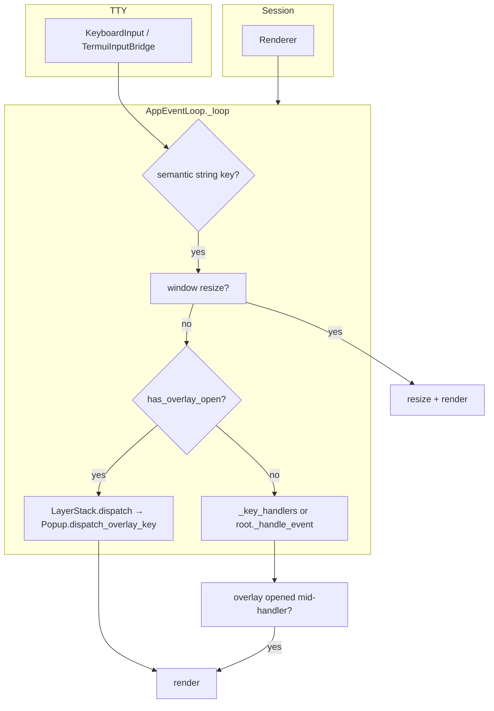

# `pigit.termui`

Lightweight, keyboard-first terminal UI primitives for full-screen TUIs and modal overlays. The package separates **input semantics**, **rendering**, **component trees**, **bindings**, and **overlay modality** so application code (for example `pigit.app`) can compose apps via `PigitApplication(Application)` without duplicating low-level terminal logic.

## Goals

- **Single event loop** over a **component tree** with optional **decorator/class `BINDINGS`** merging.
- **Layered overlays (MODAL / TOAST / SHEET) via LayerStack**: keys are routed to the top-most MODAL layer when open; unbound keys do not fall through to the main content (modal-style behavior). TOAST and SHEET layers do not intercept input.
- **POSIX TTY** session handling (alternate screen, termios) isolated from keyboard decoding.
- **Safe overlay text** via `sanitize_for_display` (control characters stripped or normalized).

## Architecture (overview)



- **Session** opens the alternate screen and attaches a **Renderer** to the tree (`_bind_renderer_tree`).
- **Loop root** (`_child`) is `ComponentRoot`, which delegates overlay checks and dispatch to `LayerStack`.
- **Overlay** path uses `OverlayDispatchResult` and redraws after each key when a modal is active.

## Package map

| Module | Role |
|--------|------|
| `components.py` | `Component` ABC, `Container`, list/browser helpers (`ItemSelector`, `LineTextBrowser`), `GitPanelLazyResizeMixin`, overlay defaults (`has_overlay_open`, `try_dispatch_overlay`), `nearest_overlay_host()` |
| `components_overlay.py` | `Popup` (modal shell for one child), `AlertDialog`, `HelpPanel` (bordered regions via `Renderer.draw_panel`) |
| `layer.py` | `LayerStack`, `Layer`, `LayerKind` (`NONE` / `MODAL` / `TOAST` / `SHEET`): layered overlay management |
| `root.py` | `ComponentRoot`: internal framework root, wraps body + LayerStack, manages overlay state |
| `application.py` | `Application` facade: high-level entry point for app wiring |
| `overlay_controller.py` | Forwards keys to ``_active_popup.dispatch_overlay_key`` (exception-safe) |
| `overlay_kinds.py` | `OverlayKind` (`NONE` \| `POPUP`), `OverlayDispatchResult`, `OverlaySurface` protocol |
| `event_loop.py` | `AppEventLoop`, `ExitEventLoop`; resize → overlay → main dispatch order; first-frame redraw when a child opens an overlay mid-handler |
| `session.py` | `Session`: TTY setup, `Renderer` attached to stdout |
| `render.py` | `Renderer`: cursor moves, `draw_panel`, clearing |
| `bindings.py` | `bind_keys`, `list_bindings`, `BindingError`, merged handler resolution |
| `keys.py` | Semantic key constants and helpers (e.g. `KEY_ESC`, `is_mouse_event`) |
| `text.py` | Display width (`get_width`, `plain`), `sanitize_for_display` |
| `input_keyboard.py` | Low-level byte reader → semantic strings |
| `input_terminal.py` | `InputTerminal` protocol |
| `tui_input_bridge.py` | Bridge implementing `InputTerminal` over `KeyboardInput` |
| `geometry.py` | `TerminalSize` and related helpers |
| `component_list_picker.py` | Searchable list picker component (CLI/repo flows) |
| `picker_event_loop.py` | Picker-oriented loop helpers |
| `picker_layout.py` | Layout helpers for pickers |
| `key_echo.py` | Development / debugging key echo utility |
| `tty_io.py`, `wcwidth_table.py`, `input_trie.py` | Internal utilities for I/O and width |

## Minimal example

Run from a real terminal (TTY). This shows a one-line screen and quits on `q`:

```python
from pigit.termui import AppEventLoop, Component, ExitEventLoop


class DemoRoot(Component):
    NAME = "demo"

    def _render_surface(self, surface):
        surface.draw_row(0, "termui minimal demo — press q to quit")


class DemoLoop(AppEventLoop):
    BINDINGS = [("q", "quit")]

    def quit(self) -> None:
        raise ExitEventLoop("bye")


if __name__ == "__main__":
    DemoLoop(DemoRoot(), alt=False).run()
```

Full Git TUI wiring (tabs, help, alerts, toasts) lives in `pigit.app` (`PigitApplication(Application)`).

## Public API (`from pigit.termui import …`)

Stable names are listed in `__all__` inside `__init__.py`. Highlights:

- **Tree**: `Component`, `Container`, `ActionLiteral`, `GitPanelLazyResizeMixin`, `ItemSelector`, `LineTextBrowser`
- **Overlay**: `Popup`, `AlertDialog`, `HelpPanel`, `HelpEntry`, `OverlayKind`, `OverlayDispatchResult`, `OverlaySurface`
- **Application**: `Application` (`ComponentRoot` + `LayerStack` are internal and not exported)
- **Loop**: `AppEventLoop`, `ExitEventLoop`, `Session`, `Renderer`, `TerminalSize`
- **Bindings**: `bind_keys`, `list_bindings`, `BindingError`
- **Input**: `KeyboardInput`, submodule `keys`
- **Text**: `sanitize_for_display`, `get_width`, `plain`, `run_key_echo`

Import the package once for app-level wiring:

```python
from pigit.termui import AppEventLoop, Container, Application, bind_keys, keys
```

## Architecture (detail)

### Component tree and loop root

`AppEventLoop` holds a single **root** `Component` (`_child`). In practice this is `ComponentRoot`, which owns a `LayerStack` and a body component. `ComponentRoot` implements `has_overlay_open()` and `try_dispatch_overlay(key)` by delegating to its `LayerStack`.

Application code constructs **`Popup(help_panel, session_owner=self, …)`** (``_help_panel`` / ``_help_popup``); the shell resolves the host like **`AlertDialog`** (``session_owner`` may be the root host or a child; :meth:`~pigit.termui.components_overlay.Popup._resolved_overlay_host` uses :meth:`~pigit.termui.components.Component.nearest_overlay_host` or treats ``session_owner`` as the host when it owns overlay state). Call :meth:`~pigit.termui.components_overlay.HelpPanel.merge_help_entries_from_host_children` from the app when opening help if you want rows synced from ``host.children`` (not from ``Popup``). Bind ``?`` to a handler that refreshes help then **`_help_popup.toggle()`**. **`AlertDialog`** subclasses **`Popup`**, passes **`session_owner`** to the base, overrides ESC via **`_on_exit_key`**, and uses session management via the resolved host.

Panels that open alert sessions typically expose **`_alert_popup`** and **`_alert_dialog`** (often the same `AlertDialog` instance).

### Overlay flow

1. **State**: `LayerStack` manages layers by `LayerKind`: `NONE`, `MODAL`, `TOAST`, `SHEET`. ``_active_popup`` on `ComponentRoot` tracks the modal shell (help `Popup`, `AlertDialog`, etc.) for backward compatibility.
2. **Shell**: Any component can gain modal behavior when wrapped by :class:`~pigit.termui.components_overlay.Popup`; `ComponentRoot` delegates overlay management to `LayerStack`.
3. **Help**: :class:`~pigit.termui.components_overlay.HelpPanel` is content only; :class:`~pigit.termui.components_overlay.Popup` with ``session_owner`` runs :meth:`~pigit.termui.components_overlay.Popup.toggle` / ESC against the resolved host session. The app may sync rows via :meth:`~pigit.termui.components_overlay.HelpPanel.merge_help_entries_from_host_children` before toggling open.
4. **Alert**: A panel owns `_alert_dialog` / `_alert_popup` (same `AlertDialog` instance); opening pushes a `LayerKind.MODAL` layer onto `LayerStack`.
5. **Dispatch**: `LayerStack.dispatch` forwards keys to the top-most MODAL layer's `OverlaySurface` via ``dispatch_overlay_key`` (shell bindings, then child, then ``Popup._fallback_overlay_key`` for help ``?`` or swallow). TOAST and SHEET layers do not intercept input dispatch. Handler failures yield :data:`~pigit.termui.overlay_kinds.OverlayDispatchResult.CLOSED_AFTER_ERROR` and ``KeyDispatchOutcome`` ``overlay_closed_after_error``. The loop root overrides `_handle_event` so ``?`` is handled before tab routing when no overlay is open.

### Rendering

`Session` creates a `Renderer` bound to the terminal. `AppEventLoop._bind_renderer_tree` walks ``children`` only. Side-attached :class:`~pigit.termui.components_overlay.Popup` instances (e.g. ``_help_popup``) are **not** in that map; they receive the same renderer via :meth:`~pigit.termui.components_overlay.Popup._sync_renderer_from_session_owner` (``session_owner`` and its ``parent`` chain). `AppEventLoop.render()` builds a `Surface`, calls `_render_surface()` on the root component tree, and then `LayerStack.render(surface)` after body render so the modal shell is drawn on top. Application code should not rely on those private hooks unless extending `termui` itself.

### Bindings

`bind_keys` attaches handlers to methods; class-level `BINDINGS` lists are merged with `resolve_key_handlers_merged`. Duplicate keys toward the same target raise `BindingError` in strict mode (see `bindings.py`).

## Related application code

`pigit.app` defines `PigitApplication(Application)` and Git-specific panels; it imports from `pigit.termui` as the single entry point for the primitives above.

## Tests

Project tests under `tests/tui/` and `tests/termui/` cover bindings, the event loop, and input contracts. Run them with:

```bash
python3 -m pytest tests/tui tests/termui -q
```
