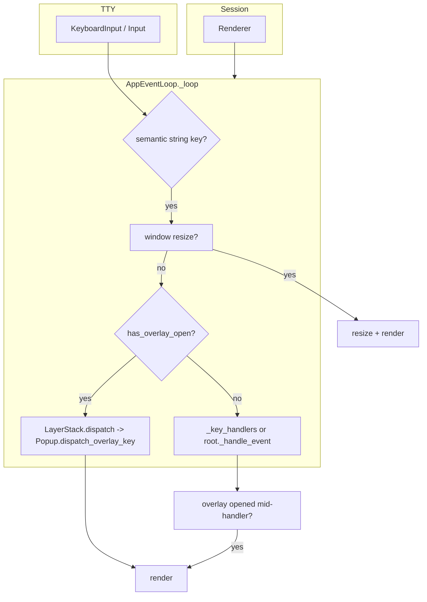
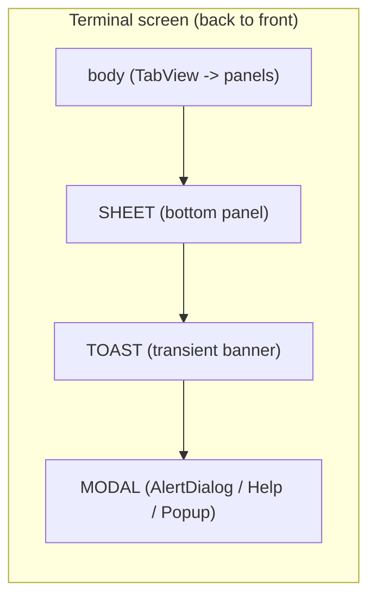
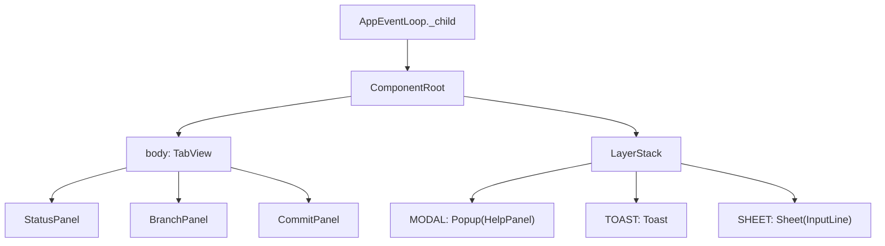
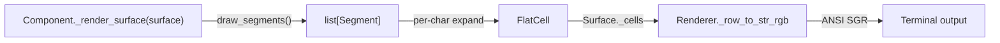

# `pigit.termui`

Lightweight, keyboard-first terminal UI primitives for full-screen TUIs and modal overlays. The package separates **input semantics**, **rendering**, **component trees**, **bindings**, and **overlay modality** so application code (for example `pigit.app`) can compose apps via `Application` without duplicating low-level terminal logic.

**Requires Python 3.10+.**

## Goals

- **Single event loop** over a **component tree** with optional **decorator/class `BINDINGS`** merging.
- **Layered overlays (MODAL / TOAST / SHEET) via LayerStack**: keys are routed to the top-most MODAL layer when open; unbound keys do not fall through to the main content (modal-style behavior). TOAST and SHEET layers do not intercept input.
- **POSIX TTY** session handling (alternate screen, termios) isolated from keyboard decoding.
- **Renderer context via ContextVar**: components access the current renderer through `get_renderer()` / `get_renderer_strict()` without tree traversal.
- **Segment-first rendering**: all styled text goes through the `Segment` dataclass (fg/bg + style flags), replacing the old `(text, fg, bold)` tuple.

## Architecture

### Key dispatch flow



- **Session** opens the alternate screen and creates a **Renderer**.
- **Renderer** is bound to the current context via `ContextVar` (`set_renderer` / `reset_renderer`).
- **Loop root** (`_child`) is `ComponentRoot`, which delegates overlay checks and dispatch to `LayerStack`.
- **Application** facade (`Application` class) wraps `build_root()` -> `ComponentRoot` -> `_ApplicationEventLoop` assembly.

### Layer stacking

Overlays are drawn in z-order; TOAST and SHEET do not intercept keys, MODAL does:



### Component tree



### Segment render pipeline



## Package map

| Module | Role |
|--------|------|
| `_component.py` | `Component` ABC, `ComponentError`, `bind_signals` |
| `containers/` | `TabView` (tabbed stack), `Column`, `Row` (layout containers) |
| `widgets/` | `ItemList`, `InputLine`, `CheckList`, `Header`, `HelpPanel`, `Popup`, `Toast`, `Sheet`, `LineTextBrowser`, `Graph`, `StatusBar` |
| `_layer.py` | `LayerStack`, `Layer`, `LayerKind` (`NONE` / `MODAL` / `TOAST` / `SHEET`) |
| `_segment.py` | `Segment` dataclass for styled text (fg/bg, style flags) |
| `_color.py` | `ColorAdapter`, `ColorMode` — color mode detection and ANSI adapter |
| `palette.py` | Color constants (`DEFAULT_FG`, `DEFAULT_BG`, `DEFAULT_FG_DIM`) and style flags (`STYLE_BOLD`, `STYLE_DIM`, etc.) |
| `reactive.py` | `Signal`, `Computed` reactive primitives (not exported from `__init__`) |
| `_root.py` | `ComponentRoot`: internal framework root, wraps body + LayerStack |
| `_runtime_context.py` | Consolidated context — renderer, session, overlay, registry, focus manager |
| `_application.py` | `Application` facade: high-level entry point for app wiring |
| `event_loop.py` | `AppEventLoop`, `ExitEventLoop`; resize -> overlay -> main dispatch |
| `_session.py` | `Session`: TTY setup, creates `Renderer` |
| `_renderer.py` | `Renderer`: cursor moves, `draw_panel`, incremental `render_surface` |
| `_surface.py` | `Surface` / `Cell` intermediate layer; `subsurface` for component clipping |
| `_bindings.py` | `bind_keys`, `list_bindings`, `BindingError`, merged handler resolution |
| `keys.py` | Semantic key constants and helpers (e.g. `KEY_ESC`, `is_mouse_event`) |
| `_text.py` | Display width (`get_width`, `plain`), `sanitize_for_display` |
| `input.py` | Low-level byte reader -> semantic strings, terminal input handling |
| `_async_task.py` | `AsyncTask` for non-blocking data loading in components |
| `_frame.py` | `BoxFrame`: reusable bordered frame layout helpers |
| `_layout.py` | `SizeModifier` protocol and layout utilities |
| `_syntax.py` | `SyntaxTokenizer` |
| `_syntax_configs.py` | Language syntax keyword configurations |
| `types.py` | `ActionEventType`, `LayerKind`, `OverlayDispatchResult`, `ToastPosition`, protocols |
| `tty_io.py`, `wcwidth_table.py` | Internal utilities for I/O and width |

## Public API

Stable names are listed in `__all__` inside `__init__.py`.

| Category | Names |
|----------|-------|
| **Core** | `Component`, `ComponentError`, `ActionEventType`, `bind_signals` |
| **Containers** | `TabView`, `Column`, `Row` |
| **Widgets** | `ItemList`, `LineTextBrowser`, `Header`, `InputLine`, `StatusBar`, `CheckList`, `Graph` |
| **Overlays** | `Popup`, `AlertDialog`, `AlertDialogBody`, `HelpPanel`, `HelpEntry`, `Sheet`, `Toast` |
| **Overlay types** | `LayerKind`, `OverlayDispatchResult`, `ToastPosition`, `OverlaySurface` |
| **Application** | `Application`, `ComponentRoot`, `ExitEventLoop` |
| **Rendering** | `Surface`, `FlatCell`, `Cell`, `Segment`, `palette`, `ColorAdapter`, `ColorMode`, `Renderer`, `get_renderer_strict`, `SurfaceProtocol` |
| **Bindings** | `bind_keys`, `list_bindings`, `BindingError` |
| **Registry** | `by_id`, `get_registry` |
| **Overlay context** | `show_toast`, `show_sheet`, `dismiss_sheet`, `show_badge`, `get_badge`, `get_badge_signal`, `show_spinner`, `hide_spinner`, `exec_external` |
| **Text** | `plain`, `SyntaxTokenizer` |
| **Keys** | `keys` (submodule) |

## Import style

Import the package once for app-level wiring:

```python
from pigit.termui import Application, Component, bind_keys, keys
from pigit.termui.containers import TabView
```

`keys` and `palette` are exported as submodules (not flat constants). Always access them qualified:

```python
from pigit.termui import keys, palette, Segment

# Key constants
@bind_keys("j", keys.KEY_DOWN)
def next(self): ...

# Style flags
Segment("bold text", style_flags=palette.STYLE_BOLD)
```

Inside `pigit.termui` itself, **all** cross-module imports must use relative paths. Never use `from pigit.termui.xxx import ...` inside the package:

```python
# Correct
from . import keys
from . import palette
from ._component import Component, bind_signals
from .reactive import Signal, Computed

# Wrong — absolute paths are forbidden inside the package
from pigit.termui import keys
from pigit.termui._component import Component
```

## Architecture (detail)

### Application facade

`Application` is the high-level entry point. Subclasses implement `build_root()` and optional `BINDINGS`:

```python
class MyApp(Application):
    BINDINGS = [("Q", "quit")]

    def build_root(self):
        return TabView({"main": MyPanel()})

    def setup_root(self, root):
        # Attach overlays here
        self._help_popup = Popup(self._help_panel)

    def quit(self):
        raise ExitEventLoop("Quit")

MyApp().run()
```

`_ApplicationEventLoop` bridges `Application` into `AppEventLoop`: app-level bindings take precedence over child tree bindings when no overlay is open.

### Component tree and loop root

`AppEventLoop` holds a single root `Component` (`_child`). In practice this is `ComponentRoot`, which owns a `LayerStack` and a body component. `ComponentRoot` implements `has_overlay_open()` and `try_dispatch_overlay(key)` by delegating to its `LayerStack`.

Application code constructs `Popup(help_panel)` (`_help_panel` / `_help_popup`); `_runtime_context` provides overlay helpers to push/pop modal layers onto the host's `LayerStack`. Call `HelpPanel.refresh_entries_from_source()` from the app when opening help if you want rows synced from `host.children` (not from `Popup`). Bind `?` to a handler that refreshes help then `_help_popup.toggle()`. `AlertDialog` subclasses `Popup` and overrides ESC via `_on_exit_key`; it uses `_runtime_context` for session management.

Panels that open alert sessions typically expose `_alert_dialog` and `_alert_popup` (often the same `AlertDialog` instance).

### Overlay flow

1. **State**: `LayerStack` manages layers by `LayerKind`: `NONE`, `MODAL`, `TOAST`, `SHEET`. `ComponentRoot` is the overlay host; `Popup` / `AlertDialog` push/pop `MODAL` layers.
2. **Shell**: Any component can gain modal behavior when wrapped by `Popup`; `ComponentRoot` delegates overlay management to `LayerStack`.
3. **Help**: `HelpPanel` is content only; `Popup` runs `toggle()` / ESC via `_runtime_context`. The app may sync rows via `refresh_entries_from_source()` before toggling open.
4. **Alert**: A panel owns `_alert_dialog` / `_alert_popup` (same `AlertDialog` instance); opening pushes a `LayerKind.MODAL` layer onto `LayerStack`.
5. **Dispatch**: `LayerStack.dispatch` forwards keys to the top-most MODAL layer's `OverlaySurface` via `dispatch_overlay_key` (shell bindings, then child, then `Popup._fallback_overlay_key` for help `?` or swallow). TOAST and SHEET layers do not intercept input dispatch. Handler failures yield `OverlayDispatchResult.CLOSED_AFTER_ERROR` and cleanup the modal slot.
6. **Toast**: `ComponentRoot.show_toast()` creates a `Toast` on the `TOAST` layer with slide-in/out animation and auto-expiration. Only one toast is shown at a time.
7. **Sheet**: `ComponentRoot.show_sheet()` creates a `Sheet` on the `SHEET` layer (bottom panel).

### Rendering and ContextVar

`Session` creates a `Renderer` bound to the terminal. `AppEventLoop.run()` enters the Session context and calls `set_renderer(session.renderer)`, making the renderer available to all components via:

```python
renderer = get_renderer()         # may be None
renderer = get_renderer_strict()  # raises if not set
```

`AppEventLoop.render()` builds a `Surface`, calls `_render_surface()` on the root component tree, and then `LayerStack.render(surface)` after body render so overlays are drawn on top.

Components implement `_render_surface(surface)` instead of the legacy `_render()`. `Surface` provides `draw_text_rgb`, `draw_segments`, `fill_rect_rgb`, and `subsurface` for child clipping. Styled text is drawn via `Segment`.

### Segment (styled text)

`Segment` replaces the old `(text, fg, bold)` tuple with a `__slots__` dataclass supporting:

- `text: str` — raw text content
- `fg: Optional[tuple[int, int, int]]` — foreground RGB, `None` for default
- `bg: Optional[tuple[int, int, int]]` — background RGB, `None` for default
- `style_flags: int` — bitmask from `palette` (`STYLE_BOLD`, `STYLE_DIM`, `STYLE_ITALIC`, `STYLE_UNDERLINE`, `STYLE_REVERSE`)

Convenience class methods: `Segment.bold(text)`, `Segment.dim(text)`, `Segment.reverse(text)`.

Draw a list of segments with `surface.draw_segments(row, col, segments)`. Individual segments are also accepted by `draw_text_rgb` for one-off styled text.

```python
from pigit.termui import Segment, palette

segments = [
    Segment("main", fg=(100, 200, 100), style_flags=palette.STYLE_BOLD),
    Segment("  up3", fg=(200, 180, 80)),
]
```

### Bindings

`bind_keys` attaches handlers to methods; class-level `BINDINGS` lists are merged with `resolve_key_handlers_merged`. Duplicate keys toward the same target raise `BindingError` in strict mode (see `_bindings.py`).

```python
class MyPanel(Component):
    BINDINGS = [("q", "quit")]

    @bind_keys("j", keys.KEY_DOWN)
    def next(self):
        ...

    def quit(self):
        raise ExitEventLoop("Quit")
```

## Minimal example

Run from a real terminal (TTY). This shows a one-line screen and quits on `q`:

```python
from pigit.termui import AppEventLoop, Component, ExitEventLoop


class DemoRoot(Component):
    NAME = "demo"

    def _render_surface(self, surface):
        surface.draw_text_rgb(0, 0, "termui minimal demo - press q to quit", fg=(220, 220, 230), bg=(18, 18, 22))


class DemoLoop(AppEventLoop):
    BINDINGS = [("q", "quit")]

    def quit(self) -> None:
        raise ExitEventLoop("bye")


if __name__ == "__main__":
    DemoLoop(DemoRoot(), alt=False).run()
```

Full Git TUI wiring (tabs, help, alerts, toasts) lives in `pigit.app` (`PigitApplication(Application)`).

## Design constraints

When adding new components or extending existing ones, follow these rules so the codebase stays consistent:

1. **Segment-first rendering**
   - All new text rendering must use `Segment` (or `draw_segments`).
   - The old `(text, fg, bold)` tuple is deprecated; do not introduce new call sites.
   - `FlatCell(..., bold=True)` remains supported for backward compatibility (internally mapped to `style_flags |= STYLE_BOLD`).

2. **Colors and style flags via `palette`**
   - Never hard-code RGB tuples in component code.
   - Always reference colors through `palette.DEFAULT_FG`, `palette.DEFAULT_BG`, `palette.DEFAULT_FG_DIM`, etc.
   - Style flags (`STYLE_BOLD`, `STYLE_DIM`, `STYLE_ITALIC`, `STYLE_UNDERLINE`, `STYLE_REVERSE`) live in `palette`.

3. **Key constants via `keys`**
   - Never use raw string literals for special keys (e.g. `"\x1b"` for ESC).
   - Use `keys.KEY_ESC`, `keys.KEY_ENTER`, `keys.KEY_DOWN`, etc.

4. **Import style**
   - Inside `pigit.termui`: always use relative imports (`from . import keys`, `from .reactive import Signal`).
   - Outside `pigit.termui`: `from pigit.termui import keys, palette`.
   - **Reactive primitives are NOT exported from `__init__.py`**. Import them explicitly:
     ```python
     from pigit.termui.reactive import Signal, Computed
     ```
   - Access qualified: `keys.KEY_DOWN`, `palette.STYLE_BOLD`.

5. **Render interface**
   - New components implement `_render_surface(surface)`.
   - The old `_render()` method is legacy and should not be used for new code.

6. **DiffViewer exclusion**
   - `DiffViewer` is explicitly excluded from the Segment migration.
   - Do not refactor DiffViewer to use `Segment` or `draw_segments`.

7. **Overlay state cleanup**
   - Handlers that show spinners or sheets must clean up on **all** exception paths (GitError and generic Exception).
   - The event loop catches and logs handler failures, but it cannot undo partial state changes.

## Tests

Project tests under `tests/termui/` cover bindings, the event loop, rendering, widgets, containers, and input contracts. Run them with:

```bash
python3 -m pytest tests/termui -q
```
